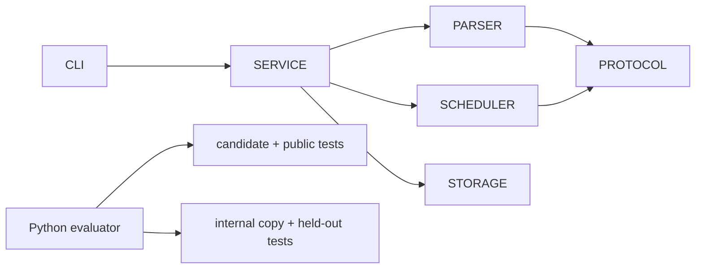

# Rust Systems Reliability RL Lab

[](https://github.com/Kartikm09/rust-systems-reliability-rl-lab/actions/workflows/ci.yml)
[](LICENSE)

A Rust 2024 multi-crate event-processing and scheduling engine plus four reproducible
environments for assessing coding-agent patches. The project demonstrates parser
hardening, explicit error models, ownership-aware concurrency, graceful shutdown,
property testing, and benchmark-backed optimization.

**Toolchain:** Rust 1.97.1 stable, Cargo workspace resolver 3, rustfmt, Clippy with
warnings denied, proptest, loom, Criterion, cargo-audit, and cargo-deny.

> This is independent proof of work built from synthetic code and fixtures. It was not
> commissioned or reviewed by an employer, platform, or private benchmark owner.

## Architecture



## Task catalogue

| Task | Engineering work | Evidence |
| --- | --- | --- |
| `task-001` | Repair bounded protocol parsing | malformed-input, property, and regression tests |
| `task-002` | Add graceful bounded shutdown | FIFO, cancellation, and accounting tests |
| `task-003` | Refactor to structured domain errors | API, Display, and CLI exit-code contracts |
| `task-004` | Eliminate hot-path cloning | deterministic clone metric and Criterion evidence |

## One-command quick start

```bash
make setup && make verify-all
```

Run the CLI with `cargo run -p cli -- demo` or start the local health service with
`cargo run -p cli -- serve`. Docker Compose exposes `http://localhost:8082/health`.

## Evaluate a patch

```bash
make evaluate TASK=task-001 PATCH=tasks/task-001/golden/solution.patch
```

Candidate workspaces contain only task baselines and public tests. The evaluator applies
the patch after scope checks, then overlays held-out tests into a separate internal copy.
It emits `result.json`, `evaluation_report.md`, `test_summary.json`,
`changed_files.json`, `timing.json`, and `score_breakdown.json`.

**Accepted example:** `task-001/golden/solution.patch` rejects oversized frames before
allocation, handles escaping, and passes public, held-out, and regression tests.

**Rejected example:** `incorrect_patches/malformed.patch` returns
`classification=malformed_patch` without executing candidate code.

## Quality commands

```bash
cargo fmt --all -- --check
cargo clippy --workspace --all-targets --all-features -- -D warnings
cargo test --workspace --all-features
cargo test --doc --workspace
cargo bench --workspace
cargo audit
cargo deny check
```

See the measured [benchmark evidence](reports/benchmark-evidence.md) and final
[Docker verification](reports/docker-verification.md).

## Skills demonstrated

Rust 2024, ownership, structured errors, bounded queues, cancellation, concurrency,
parser security, Cargo workspaces, Clippy, rustfmt, unit/integration/doc/property/model
tests, Criterion, Python evaluator design, Docker, CI/CD, and evidence-led review.

## Recruiter walkthrough

1. Read `ARCHITECTURE.md` and the task table.
2. Inspect `parser`, `scheduler`, and their property/concurrency tests.
3. Compare one baseline, golden patch, and plausible incorrect patch.
4. Review machine-readable evaluation evidence under `reports/evaluations/`.
5. Inspect CI, ADRs, security policy, and release checks.

## Security and sandbox limitations

The workspace has `unsafe_code = "forbid"`. Parser limits protect the synthetic service,
while evaluator path checks, timeouts, and output caps reduce accidental risk. The
evaluator is not a hardened sandbox; unknown patches require an external credential-free
VM or container.

## Honest limitations

Persistence is deterministic and in memory, the network protocol is intentionally small,
and the scheduler is not a distributed runtime. Deterministic work metrics stabilize task
scoring; Criterion timings remain hardware-dependent and are not universal claims.
